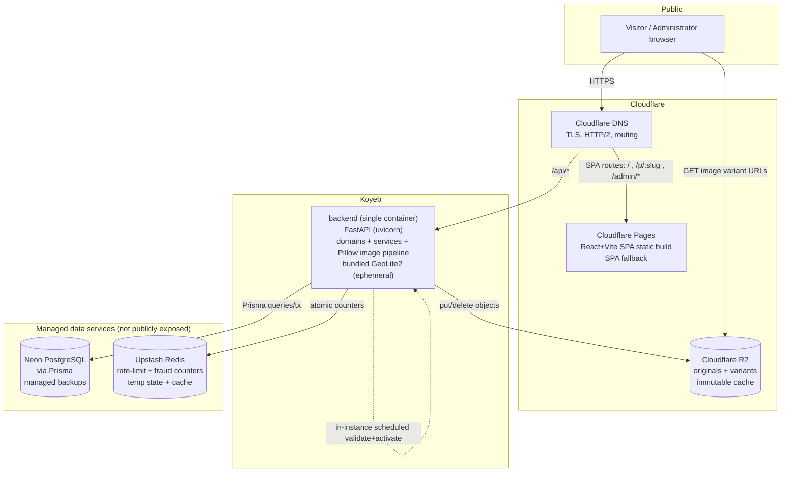

# Design Document

## Overview

The COD Commerce Platform is a lightweight, cloud-native system for selling low-ticket physical products by cash on delivery (COD / contraentrega) in Colombia. It replaces the narrow subset of Shopify, GemPages, and the Realist form app used today: banner-based product landings, CTA-triggered COD order capture, synchronous fraud controls, order administration, basic analytics, and CSV fulfillment handoff. Every capability in this design maps to one integrated flow:

> **banner landing → CTA → COD form → fraud check → order in admin**

The system runs entirely on managed cloud services. A statically built React + Vite SPA (public storefront and private admin) is built and served by **Cloudflare Pages**. **Cloudflare DNS** routes public traffic to Cloudflare Pages and to the backend. The **FastAPI (Python 3)** backend runs as a single Docker container on **Koyeb**. Durable application records live in managed **Neon PostgreSQL**, accessed through **Prisma ORM**. **Upstash Redis** provides rate-limit counters, fraud rolling-window counters, temporary state, and caching. Images are processed with **Pillow** inside the backend container and stored — originals plus generated responsive variants — in **Cloudflare R2** object storage, served publicly through Cloudflare with immutable long-lived cache headers. GeoIP resolution uses a self-hosted MaxMind GeoLite2 database resolved locally in the container. Administrator sessions use short-lived signed JWTs. No external CDN beyond Cloudflare, no hosted image transformation beyond R2/Cloudflare, no paid geolocation API, and no additional paid external SaaS participates in the runtime request path.

**End-to-end COD flow.** A visitor arriving from paid social traffic opens a published landing at `/p/{slug}`. The SPA (served by Cloudflare Pages) fetches the landing payload from the Koyeb backend (banners in stored order with responsive image candidates whose URLs point at R2/Cloudflare, plus computed CTA insertion points) and records a landing view. The visitor scrolls through 1–15 banners; CTAs are rendered according to the landing's placement mode (after every banner, after every N banners, or at fixed positions). Activating a CTA records a CTA click and opens the COD form inline or in an accessible modal, per landing configuration. The visitor submits full name, Colombian phone number, department, city, address, and quantity. The backend independently re-validates and normalizes every field, captures attribution (product, landing id + slug) and request metadata (IP, user agent), evaluates fraud checks synchronously — rate-limit counters in Upstash Redis, duplicate/blacklist/GeoIP against Postgres and the local GeoLite2 database — then persists the order exactly once inside a single Prisma transaction: `pending` when every enabled check passes, or `flagged_fraud` with one machine-readable fraud flag per triggered rule. Both GeoIP `flag` and GeoIP `block` outcomes persist a reviewable `flagged_fraud` order; submissions are never silently dropped. The order and its flags then appear in the Admin Dashboard, where the Administrator filters, reviews flags, transitions status through the legal state graph, and exports filtered orders as spreadsheet-safe CSV for courier handoff.

## Architecture

The deployment is a managed cloud topology. Cloudflare is the public edge: Cloudflare Pages serves the SPA static build with browser-routing fallback, Cloudflare DNS routes `/api` traffic to the Koyeb backend, and Cloudflare serves image variants directly from R2 with an immutable long-lived cache policy. The backend is a single stateless FastAPI container on Koyeb that talks to Neon PostgreSQL (via Prisma), Upstash Redis, and Cloudflare R2. Neon and Upstash connection endpoints are never publicly exposed; only Cloudflare Pages and the Koyeb backend URL receive public traffic. Neon provides managed automated backups. GeoIP data ships inside the container image and is refreshed in-instance by a validate-before-activate task. There is no Nginx, no Docker Compose, no persistent local volume, and no custom pg_dump job.



Request paths:

- **Public landing** — `GET /` and `GET /p/:slug` are served by Cloudflare Pages (SPA fallback). The SPA then calls `GET /api/public/landings/{slug}` routed by Cloudflare DNS to the Koyeb backend.
- **Image serving** — image variant URLs (`https://{r2-public-host}/variants/{opaque_key}/{width}.{webp|jpg}`, i.e. the variant's own R2 object key, so no edge path rewrite is required) are served directly by Cloudflare from R2 with `Cache-Control: public, max-age=31536000, immutable`. The backend is not in the hot image path.
- **`/api`** — every `/api/*` request is routed by Cloudflare DNS to the Koyeb backend, which enforces authentication/authorization for private endpoints.
- **Admin SPA** — `GET /admin/*` is served by Cloudflare Pages; admin API calls go through `/api/admin/*` to the backend and require a valid Administrator session.

The following sequence shows order submission through synchronous fraud evaluation and single-order persistence. Rate-limit counts come from Upstash Redis atomic sliding-window increments; duplicate/blacklist/GeoIP evaluation and the single order insert share one Prisma transaction so classification stays consistent and durable.

```mermaid
sequenceDiagram
    autonumber
    participant SPA as SPA (Cloudflare Pages)
    participant DNS as Cloudflare DNS
    participant API as FastAPI on Koyeb
    participant SVC as OrderSubmissionService
    participant RDS as Upstash Redis
    participant FRD as FraudPreventionService
    participant GEO as GeoIP resolver (local GeoLite2)
    participant DB as Neon PostgreSQL (Prisma)

    SPA->>DNS: POST /api/public/orders {landing slug, customer fields, qty}
    DNS->>API: route POST /api/public/orders (client IP forwarded)
    API->>SVC: submit(payload, ip, user_agent)
    SVC->>SVC: validate + normalize all fields (phone, name, dept, city, addr, qty)
    alt validation fails
        SVC-->>API: field-specific 422 (no order created)
        API-->>SPA: 422 errors
    else valid submission
        SVC->>SVC: resolve active product + published landing; capture attribution + metadata
        SVC->>RDS: atomic sliding-window incr (phone key, ip key); read counts incl. current
        RDS-->>SVC: phone count, ip count
        SVC->>DB: BEGIN tx
        SVC->>FRD: evaluate(submission, redis counts, config) [synchronous]
        FRD->>DB: duplicate lookup (match fields, rolling window)
        FRD->>DB: blacklist lookup (normalized phone / ip)
        FRD->>GEO: resolve country/region for ip
        GEO-->>FRD: country | unresolved | unavailable
        FRD-->>SVC: outcome set (0..n triggered flags)
        alt no flags triggered
            SVC->>DB: INSERT order status=pending
        else one or more flags
            SVC->>DB: INSERT order status=flagged_fraud
            SVC->>DB: INSERT fraud_flags (one row per triggered rule)
        end
        SVC->>DB: COMMIT
        alt persistence error
            SVC->>DB: ROLLBACK
            SVC-->>API: non-sensitive failure (no partial order)
            API-->>SPA: 503/500 generic
        else committed
            SVC-->>API: completed result (order id, classification)
            API-->>SPA: 201 submitted
        end
    end
```

## Technology Stack and Constraints

Approved stack (no substitutions without an approved scope/architecture update):

- **Frontend** — React + Vite + React Router, TypeScript strict mode. A single statically built SPA serves both the public storefront and the private admin, built and hosted by Cloudflare Pages. No SSR/Next.js in v1.
- **Edge / DNS / TLS** — Cloudflare DNS routes public traffic to Cloudflare Pages (SPA) and the Koyeb backend; Cloudflare and Koyeb provide TLS, HTTP/2, and text compression. No Nginx or reverse-proxy container.
- **Backend** — FastAPI on a supported Python 3 release, packaged as a single Docker container deployed to Koyeb, with explicit typed request/response schemas at every boundary and generated OpenAPI. Business rules live in domain/service modules; routers stay thin.
- **Database** — managed Neon PostgreSQL accessed through Prisma ORM (Prisma Client Python). Schema defined in a Prisma schema file and applied with `prisma migrate`. `Decimal`/Postgres numeric for money, `timestamptz` (UTC) for time.
- **Cache / counters** — Upstash Redis for login rate limiting, fraud rate-limit rolling-window counters, temporary state, and caching. Redis counters are best-effort/ephemeral; the durable order and fraud record is always in Postgres.
- **Object storage / images** — Cloudflare R2 for source images and generated variants. Pillow runs in the backend container to validate, strip EXIF, and generate WebP + JPEG variants, then uploads objects to R2 under opaque keys. Public delivery is directly from R2 through Cloudflare.
- **GeoIP** — self-hosted MaxMind GeoLite2 database resolved locally in the backend container. No paid runtime geolocation API.
- **Authentication** — short-lived signed JWT Administrator sessions; one Administrator role for the MVP with code boundaries that can later admit staff roles.

Explicit exclusions (must not appear in v1, and must not be added behind unrequested flags):

- Online payment gateways or native paid checkout; COD only.
- Shopify Markets, multi-currency, multi-language storefronts.
- Drag-and-drop page builders, theme marketplaces, theme customizers (only ordered up/down or order-index banner controls).
- Third-party app marketplaces, subscriptions, recurring billing.
- Multi-warehouse routing, POS, in-person sales.
- External CDN beyond Cloudflare; hosted image transformation or remote image optimization beyond R2/Cloudflare; paid page-builder SaaS.
- SSR/Next.js.
- Email/Telegram/WhatsApp fraud alerts; review is dashboard-only.
- Dedicated database connection pooler, Kubernetes/multi-node orchestration, horizontal replicas, additional message brokers, and any additional paid external SaaS beyond Cloudflare, Koyeb, Neon, and Upstash.
- Any runtime dependency on external image transformation, analytics, geolocation, or page-building services.

## Project Structure

The layout follows AGENTS.md. Domain logic stays out of route handlers and React page components; modules are named by responsibility (no generic `utils` dumping grounds).

```text
/
├── AGENTS.md
├── features.json
├── .env.example                     # variable names + safe examples only, no secrets
├── prisma/
│   └── schema.prisma                # Prisma schema for Neon PostgreSQL (models, indexes, constraints)
├── frontend/
│   ├── public/
│   ├── wrangler / pages config      # Cloudflare Pages build + SPA fallback config
│   └── src/
│       ├── api/                     # typed API client, transport, auth/error handling
│       ├── components/              # reusable presentational components (banner, cta, form fields, modal)
│       ├── features/                # product, landing, checkout, orders, fraud, analytics feature modules
│       ├── routes/                  # public /p/:slug + private /admin/* route definitions and guards
│       ├── styles/
│       └── test/                    # component/interaction tests, fast-check property tests
├── backend/
│   ├── Dockerfile                   # single FastAPI container image for Koyeb (bundles GeoLite2)
│   ├── app/
│   │   ├── api/                     # FastAPI routers + dependencies (auth, prisma client, request context)
│   │   ├── core/                    # settings, JWT auth, password hashing, logging, security helpers
│   │   ├── db/                      # Prisma client wrapper, repositories, migration integration
│   │   ├── domains/                 # products, landings, orders, fraud, analytics, images (domain rules)
│   │   ├── schemas/                 # external request/response Pydantic models
│   │   ├── services/                # orchestration/use cases (order submission, publication, export, jobs)
│   │   ├── redis/                   # Upstash Redis client + rate-limit / counter helpers
│   │   └── main.py                  # app factory, router wiring, middleware
│   └── tests/                       # unit, integration/E2E, Hypothesis property tests, fixtures
└── infrastructure/
    ├── koyeb/                       # Koyeb service/deploy manifest and health-check config
    ├── cloudflare/                  # Pages + DNS + R2 public-host config notes
    ├── r2/                          # R2 bucket lifecycle/CORS/cache config
    └── geoip/                       # GeoLite2 provisioning (build bundling) + validate/activate scripts
```

`backend/app/db/` wraps the Prisma client and exposes repository classes that own all queries; models never leak across the API boundary. Neon managed backups replace any application-level backup job.

## Data Model

The schema is defined in the Prisma schema file and applied to Neon PostgreSQL with `prisma migrate`. All money is Postgres numeric (Prisma `Decimal`), never floating point; all timestamps are `timestamptz` stored in UTC and returned as ISO 8601 with offset. Every model has `created_at` (default now()); mutable models add `updated_at`. Soft-deletion uses a nullable `retired_at` rather than physical deletion so order and fraud history survive product/landing retirement. Foreign keys from historical evidence (orders, fraud flags, audit log) use restrict semantics — retirement is a status change, never a cascade. Rolling-window rate-limit counting lives in Upstash Redis (see Fraud Evaluation); Postgres holds the durable orders and fraud flags.

### products

| Column | Type | Notes |
|---|---|---|
| id | bigint PK (identity) | |
| name | text not null | trimmed 1–160 chars (`CHECK char_length between 1 and 160`) |
| sku | text not null | merchant-assigned |
| price | numeric(12,2) not null | `CHECK price >= 0.01 AND price <= 999999999.99` |
| description | text not null default '' | 0–5,000 chars |
| status | text not null | `CHECK status IN ('active','paused','retired')`; default `paused` |
| retired_at | timestamptz null | set on soft-deletion |
| created_at | timestamptz not null | immutable |
| updated_at | timestamptz not null | |

Uniqueness: `UNIQUE (sku)` over the normalized (trimmed) SKU across non-retired and retired products, so no two products share a SKU (req 2.5). Index: `idx_products_sku` (unique). The one-landing invariant is enforced on `landings`.

### landings

| Column | Type | Notes |
|---|---|---|
| id | bigint PK | |
| product_id | bigint not null FK → products(id) | **unique** → one landing per product |
| slug | text not null | `CHECK` slug format (lowercase letters, digits, single interior hyphens) |
| status | text not null | `CHECK status IN ('draft','published')`; default `draft` |
| cta_mode | text not null | `CHECK cta_mode IN ('after_every','every_n','fixed_positions')` |
| cta_interval | int null | required 1–15 when mode `every_n`; else null (`CHECK`) |
| cta_positions | int[] null | required non-empty unique set when mode `fixed_positions`; else null |
| form_presentation | text not null | `CHECK IN ('inline','modal')` |
| retired_at | timestamptz null | mirrors product retirement |
| created_at / updated_at | timestamptz not null | |

Keys: `UNIQUE (product_id)` (one landing per product); `UNIQUE (slug)` covering live and retired landings so retired slugs are not reissued (req 3.2). Index: `idx_landings_slug` (unique) for `/p/{slug}` lookup.

### banners

| Column | Type | Notes |
|---|---|---|
| id | bigint PK | |
| landing_id | bigint not null FK → landings(id) | |
| order_index | int not null | contiguous ascending per landing |
| alt_text | text not null | trimmed 1–200 chars (`CHECK`) |
| image_asset_id | bigint not null FK → image_assets(id) | completed upload only |
| created_at / updated_at | timestamptz not null | |

Constraints: `UNIQUE (landing_id, order_index)` (no duplicate positions); application enforces ≤ 15 banners per landing (req 3.6) and gap-closing on removal. Index: `idx_banners_landing_order (landing_id, order_index)`.

### image_assets

Represents one completed upload (an original plus its generated variants), stored in Cloudflare R2. Referenced by banners; kept for orphan-cleanup liveness.

| Column | Type | Notes |
|---|---|---|
| id | bigint PK | |
| opaque_key | text not null unique | platform-generated R2 key prefix; no client filename; used in the public URL path |
| source_object_key | text not null | R2 object key for the stored original |
| source_width | int not null | 480–8,000 |
| source_height | int not null | 1–8,000 |
| source_format | text not null | `CHECK IN ('jpeg','png','webp')` |
| status | text not null | `CHECK IN ('in_progress','complete')`; only `complete` is renderable/bannerable |
| created_at | timestamptz not null | |

Index: `idx_image_assets_opaque (opaque_key)` unique.

### image_variants

| Column | Type | Notes |
|---|---|---|
| id | bigint PK | |
| image_asset_id | bigint not null FK → image_assets(id) | |
| width | int not null | from configured set {480,768,1200,1600}, ≤ source width |
| format | text not null | `CHECK IN ('webp','jpeg')` |
| height | int not null | aspect-preserving |
| object_key | text not null | R2 object key for the variant |
| version | text not null | version token embedded in the immutable public URL |
| created_at | timestamptz not null | |

Constraint: `UNIQUE (image_asset_id, width, format)`. Index: `idx_variants_asset (image_asset_id)`.

### orders

| Column | Type | Notes |
|---|---|---|
| id | bigint PK | |
| product_id | bigint not null FK → products(id) restrict | preserved through retirement |
| landing_id | bigint not null FK → landings(id) restrict | attribution |
| landing_slug | text not null | denormalized snapshot for traceability (req 5.18) |
| customer_name | text not null | 2–120 chars |
| phone_e164 | text not null | normalized `+57` + 10 digits (national begins with `3`) |
| phone_normalized_key | text not null | normalization key used for duplicate/blacklist/rate-limit matching |
| department | text not null | 2–100 chars |
| city | text not null | 2–100 chars |
| address | text not null | 5–250 chars |
| quantity | int not null | `CHECK between 1 and 99` |
| status | text not null | `CHECK IN ('pending','confirmed','shipped','delivered','cancelled','flagged_fraud')` |
| ip_address | inet not null | request IP |
| user_agent | text not null | truncated to first 512 chars |
| created_at | timestamptz not null | analytics + duplicate window basis |
| updated_at | timestamptz not null | status transitions |

Indexes: `idx_orders_status_created (status, created_at)` and `idx_orders_product_landing_created (product_id, landing_id, created_at)` for order filtering; `idx_orders_created (created_at)` for date analytics; `idx_orders_dupe (phone_normalized_key, ip_address, created_at)` for the duplicate rolling-window lookup. Restrict FKs mean retirement (soft-delete) preserves the fulfillment and attribution record.

### fraud_flags

| Column | Type | Notes |
|---|---|---|
| id | bigint PK | |
| order_id | bigint not null FK → orders(id) restrict | |
| flag_type | text not null | `CHECK IN ('duplicate','blacklist','rate_limit_phone','rate_limit_ip','geoip')` |
| detail | jsonb not null | machine-readable: matched fields + window; entry type + reason; window counts; matched location + action |
| created_at | timestamptz not null | |

One row per triggered rule (multi-flag aggregation). Historical flags are preserved even when a blacklist entry is later removed. Index: `idx_fraud_flags_order (order_id)`.

### fraud_config

Single editable configuration row applied to subsequent submissions without redeploy.

| Column | Type | Notes |
|---|---|---|
| id | smallint PK | singleton (`CHECK id = 1`) |
| duplicate_window_hours | int not null default 24 | `CHECK > 0` |
| duplicate_match_fields | text[] not null default '{phone,ip}' | non-empty (`CHECK`) |
| rate_limit_max | int not null default 5 | `CHECK > 0` |
| rate_limit_window_minutes | int not null default 10 | `CHECK > 0` |
| updated_at | timestamptz not null | |

The rate-limit values configure the Upstash Redis sliding-window counters; duplicate values drive the Postgres duplicate lookup.

### blacklist_entries

| Column | Type | Notes |
|---|---|---|
| id | bigint PK | |
| entry_type | text not null | `CHECK IN ('phone','ip')` |
| value_normalized | text not null | normalized phone key or canonical IPv4/IPv6 text |
| reason | text not null | trimmed 1–500 chars |
| created_at | timestamptz not null | |

Constraint: `UNIQUE (entry_type, value_normalized)` (reject duplicate of same type). Removal deletes the active entry only; historical `fraud_flags` remain. Index: `idx_blacklist_lookup (entry_type, value_normalized)`.

### geoip_rules

| Column | Type | Notes |
|---|---|---|
| id | bigint PK | |
| location_code | text not null | ISO country/region code |
| action | text not null | `CHECK IN ('flag','block')` (both persist a flagged_fraud order) |
| enabled | boolean not null default true | |
| created_at / updated_at | timestamptz not null | |

Constraint: `UNIQUE (location_code)`. Index: `idx_geoip_rules_enabled (enabled, location_code)`.

### Rate-limit counters (Upstash Redis, not Postgres)

Rolling-window submission-attempt counting lives in Upstash Redis rather than a Postgres table. For each submission the backend performs an atomic sliding-window increment on two keys — `rl:phone:{phone_normalized_key}` and `rl:ip:{ip_address}` — each with a TTL equal to `rate_limit_window_minutes`. The returned count includes the current attempt and is consumed by the fraud evaluation. This keeps high-churn counter writes off the durable database while the authoritative order and fraud record remains in Postgres. Redis counters are best-effort: if Redis is unavailable the platform treats the rate-limit check as non-triggering and continues the remaining durable checks (documented in Fraud Evaluation).

### landing_views

| Column | Type | Notes |
|---|---|---|
| id | bigint PK | |
| landing_id | bigint not null FK → landings(id) | |
| created_at | timestamptz not null | day-bucket analytics |

No customer contact fields stored (req 8.14). Index: `idx_landing_views_landing_created (landing_id, created_at)`.

### cta_clicks

| Column | Type | Notes |
|---|---|---|
| id | bigint PK | |
| landing_id | bigint not null FK → landings(id) | |
| created_at | timestamptz not null | |

Index: `idx_cta_clicks_landing_created (landing_id, created_at)`.

### admin_users

| Column | Type | Notes |
|---|---|---|
| id | bigint PK | |
| username | text not null unique | |
| password_hash | text not null | memory-hard hash (Argon2id) with unique salt embedded; never plaintext |
| role | text not null default 'admin' | one role in MVP; column enables future staff roles |
| created_at / updated_at | timestamptz not null | |

### audit_log

| Column | Type | Notes |
|---|---|---|
| id | bigint PK | |
| actor | text not null | Administrator identity (or `system` for scheduled tasks) |
| action | text not null | e.g. `login.success`, `login.failure`, `order.status_change`, `fraud.config_update`, `blacklist.add` |
| target_type | text null | e.g. `order`, `product`, `landing`, `blacklist_entry` |
| target_id | text null | identifier of affected record |
| result | text not null | `success` / `rejected` / `error` |
| created_at | timestamptz not null | |

No credentials, JWT values, or full sensitive records are stored here. Index: `idx_audit_created (created_at)`.

**Lifecycle summary.** Product/landing retirement flips `status`/`retired_at` and removes public availability, but `orders`, `fraud_flags`, `banners`/`image_assets` references, attribution, and `audit_log` remain intact via restrict foreign keys and soft-deletion columns. Physical erasure through the delete operation is never performed (req 2.16, 2.21).

## API Design

Cloudflare DNS routes public traffic: Cloudflare Pages serves the SPA, `/api/*` is routed to the Koyeb backend, and image variant URLs are served directly from R2 through Cloudflare. The backend enforces auth for private endpoints. Public endpoints require no session; admin and operational endpoints require a valid Administrator JWT session. All bodies are typed JSON (except CSV export and image upload multipart). Errors return a stable error code plus field-specific validation details where safe; never stack traces or database internals. Standard error mapping: `401` unauthenticated (generic), `403` authorized-but-forbidden, `404` not found (identical for unknown/draft/paused/retired landings), `422` validation, `409` conflict (duplicate SKU/slug/blacklist), `429` rate limited (login), `503` upload-pipeline outage / persistence unavailable.

### Auth (`/api/auth`)

- `POST /api/auth/login` — public. Body `{username, password}`. On valid credentials issues a signed JWT (see Security). On invalid credentials returns generic `401` without indicating which field failed. Subject to login rate limiting via Upstash Redis (`429`). Audited.
- `POST /api/auth/logout` — session required. Invalidates the client session (clears cookie / marks token unusable per transport). Audited.
- `GET /api/auth/session` — session required. Returns `{authenticated, role}` for SPA guard hydration.

### Products (`/api/admin/products`)

- `POST /` — admin. Create product (name, sku, price, description, optional status). Atomically creates the product and its single draft landing after full validation. `422` on any field error; `409` on duplicate SKU. Audited (availability).
- `GET /` — admin. List non-retired products (retired excluded by default; optional `include_retired` for historical view).
- `GET /{id}` — admin. Return stored product fields + associated landing reference (non-retired).
- `PATCH /{id}` — admin. Update editable fields; retains id + creation timestamp. `422`/`409` on invalid/duplicate; `409`/`403` if retired.
- `POST /{id}/activate` — admin. Paused → active. Rejects if already active or retired without mutation. Audited.
- `POST /{id}/pause` — admin. Active → paused; landing becomes publicly unavailable, no data deleted. Audited.
- `DELETE /{id}` — admin. Soft-deletion → retired; preserves landing, banners, orders, flags, audit. Never physical erase. Audited (retirement).

### Landings & Banners (`/api/admin/landings`)

- `GET /{id}` — admin. Landing config, banner sequence, CTA config, presentation, publication status.
- `PATCH /{id}` — admin. Update slug, cta_mode + interval/positions, form_presentation. Validates slug format/uniqueness (`409`/`422`) and CTA config ranges; rejects invalid config without replacing the active one.
- `POST /{id}/banners` — admin. Multipart image upload + alt text. Runs the image pipeline (Pillow → R2); creates a banner at the next unique index when landing has < 15 banners. `422` validation; `409`/`422` on 16th banner; `503` during upload-pipeline outage.
- `PATCH /{id}/banners/{bannerId}` — admin. Update alt text or order index (up/down / order index only). Maintains contiguous ascending order without duplicates.
- `DELETE /{id}/banners/{bannerId}` — admin. Remove banner and close the position gap.
- `POST /{id}/publish` — admin. Publish when 1–15 valid banners and valid CTA config exist; else `422`. Audited (publication).
- `POST /{id}/unpublish` — admin. Return to draft. Audited.

### Public Landing (`/api/public`)

- `GET /public/landings/{slug}` — public, no auth. Returns landing payload (product summary, banners in order with responsive image candidates whose URLs point at R2/Cloudflare + intrinsic dimensions + JPEG fallback, computed CTA insertion points, form presentation) **only** when the product is active and the landing published. Returns an identical generic `404` for unknown, draft, paused, or retired slugs (no information disclosure).
- `POST /public/landings/{slug}/view` — public. Records one landing view (no customer contact fields).
- `POST /public/landings/{slug}/cta-click` — public. Records one CTA click.

### Checkout / Orders (`/api/public/orders`, `/api/admin/orders`)

- `POST /public/orders` — public. Body: landing slug + customer fields + quantity. Backend re-validates/normalizes all fields, captures IP + user agent, increments Upstash Redis rate-limit counters, runs synchronous fraud evaluation, and persists exactly one `pending` or `flagged_fraud` order in one Prisma transaction, returning a completed result only after persistence. `422` on validation; `503` non-sensitive failure on persistence error (no partial order). Order submission is rate-limit-evaluated as data (flagged), not blocked at the HTTP layer.
- `GET /admin/orders` — admin. List with filters: `status`, `product_id`, `landing_id`, inclusive `date_from`/`date_to`. Combined filters are ANDed. Paginated.
- `GET /admin/orders/{id}` — admin. Full order: customer delivery fields, product/landing attribution, request metadata, status, creation timestamp, all fraud flags.
- `POST /admin/orders/{id}/transition` — admin. Body `{to_status}`. Validated against the legal transition graph; illegal transitions rejected without mutation (`409`). Audited (order status).
- `GET /admin/orders/export.csv` — admin. Generates CSV of orders matching the active filters. Header row + spreadsheet-import encoding; formula-injection neutralization; atomic (no partial file on encoding failure). Audited (export access).

### Fraud Config, Blacklist, GeoIP (`/api/admin/fraud`)

- `GET /config` / `PUT /config` — admin. Read/update duplicate window, duplicate match fields, rate-limit max + window. `422` on non-positive window/threshold or empty match-field set, without replacing active config. Applied to subsequent submissions immediately. Audited.
- `GET /blacklist` / `POST /blacklist` / `DELETE /blacklist/{id}` — admin. Add validates entry type, normalized phone/IP, and 1–500 char reason (`422`); duplicate of same type rejected (`409`) without changing existing entry. Removal preserves historical flags. Audited.
- `GET /geoip-rules` / `POST /geoip-rules` / `PATCH /geoip-rules/{id}` / `DELETE /geoip-rules/{id}` — admin. Manage location + action (`flag`/`block`) + enabled. Unsupported action rejected (`422`). Audited.

### Analytics (`/api/admin/analytics`)

`date_from`/`date_to` are ISO date or date-time values interpreted in UTC and treated as an **inclusive** range: a date-only `date_to` covers that whole calendar day. A malformed bound or a start after its end is a field-specific `422`, never an unhandled parse failure.

- `GET /orders-per-day?date_from&date_to` — admin. Orders per calendar day.
- `GET /landings?date_from&date_to` — admin. Per-landing views, CTA clicks, orders, conversion rate (0 when views = 0).
- `GET /fraud?date_from&date_to` — admin. Flagged-order counts + flagged-fraud rate per calendar day (0 when orders = 0).

### Operational Read Interface (`/api/admin/ops`)

- `GET /health` — admin. Service health state only (backend, Neon, Upstash, R2 reachability booleans).
- `GET /version` — admin. Deployed application version.
- `GET /jobs` — admin. Success/failure + timestamps for last Neon backup result, GeoIP update, and image cleanup runs.

Read-only and strictly scoped to Non_Sensitive_Operational_Information: no customer data, secrets, JWT values, database/Redis/R2 connection data, filesystem paths, request payloads, log content, or stack details. Any mutation attempt or request for excluded content is rejected without releasing it (`403`/`404`).

## Component and Service Design

### Backend domains and services

- **core** — settings loader (env-based), JWT issuance/validation, Argon2id password hashing, structured logging with redaction filters, request-context dependency (extracts client IP from the trusted Cloudflare/Koyeb forwarded header, captures/truncates user agent), and shared security helpers (output encoding, redirect allowlist). FastAPI dependencies for `require_admin` and the Prisma client live here/`api`.
- **db** — Prisma client wrapper (single client instance, no dedicated pooler) and repository classes that own all Prisma queries (product, landing, banner, order, fraud, analytics, image, audit). Migration integration (`prisma migrate`) lives here; Prisma models never leak across the API boundary — repositories return domain/schema types.
- **redis** — Upstash Redis client and helpers for login rate limiting, fraud rate-limit sliding-window counters, temporary state, and caching, with atomic increment/expire operations and a documented fallback when Redis is unavailable.
- **domains/products** — product validation (name/description/price/SKU/status), lifecycle rules (paused/active/retired), one-landing invariant coordination, safe-deletion semantics.
- **domains/landings** — slug validation/uniqueness, banner ordering (unique contiguous indexes, gap closing, 1–15 bound), CTA placement computation for all three modes, form-presentation config, publication validation, and the public not-found policy (identical response for unknown/draft/paused/retired).
- **domains/orders** — field validation/normalization (including Colombian phone normalization producing a canonical `+57`+10-digit form and a stable matching key), user-agent truncation, and the centralized legal status-transition graph (`pending→confirmed→shipped→delivered`; `pending|confirmed|shipped→cancelled`; `flagged_fraud→pending|cancelled`). Illegal transitions are rejected without mutation.
- **domains/fraud** — the four checks (duplicate, blacklist, rate-limit phone/IP, GeoIP), config resolution with defaults, multi-flag aggregation, and machine-readable flag construction. Rate-limit counts are read from the redis module; duplicate/blacklist read from Postgres; GeoIP from the local resolver. Details in the Fraud Evaluation section.
- **domains/analytics** — view/click recording and per-day / per-landing aggregation, conversion and flagged-fraud rate computation with zero-guarded denominators.
- **domains/images** — the Pillow-based image pipeline (validation, EXIF stripping, variant generation, R2 upload, atomic completion, orphan cleanup, opaque-key generation with fallback). Details in the Image Pipeline section.
- **services** — orchestration/use cases that compose domains, repositories, Redis, and R2 inside transaction boundaries: `OrderSubmissionService`, `ProductLifecycleService`, `LandingPublicationService`, `BannerUploadService`, `CsvExportService`, `AnalyticsQueryService`, and the scheduled `GeoIpUpdateTask`, `ImageCleanupTask`, and `BackupMonitorTask` (records Neon backup result/verification for the ops interface).

**Order-submission orchestration** (`OrderSubmissionService.submit`):

1. **Validate** — independently re-validate and normalize every customer field, quantity, and the Colombian phone number (server-side, never trusting the SPA). Reject with field-specific errors and create no order on failure.
2. **Capture attribution/request metadata** — resolve the active product + published landing from the slug; capture product id, landing id + slug snapshot, client IP, and truncated user agent.
3. **Rate-limit counters** — perform atomic sliding-window increments in Upstash Redis for the phone key and IP key, reading counts that include the current attempt.
4. **Run all fraud checks synchronously within one Prisma transaction** — open the transaction, run duplicate (Postgres), blacklist (Postgres), rate-limit (Redis counts), and GeoIP (local resolver) checks, collecting every triggered flag.
5. **Persist exactly one order** — insert one `pending` order when no flag triggered, or one `flagged_fraud` order plus one `fraud_flags` row per triggered rule. Commit. Return the completed result only after commit; on any persistence error, roll back and return a non-sensitive failure with no partial order.

### Frontend feature modules and routes

- **api/** — typed API client mirroring backend schemas, centralized auth (JWT transport via secure HttpOnly SameSite cookie preferred) and error handling that maps backend field errors to form controls.
- **features/product, features/landing, features/checkout, features/orders, features/fraud, features/analytics** — admin feature modules for catalog CRUD, landing/banner composition (ordered up/down controls only), the public checkout form logic, order list/detail/status actions, fraud settings, and analytics dashboards.
- **components/** — reusable banner renderer (responsive `srcset`/`sizes` pointing at R2/Cloudflare URLs, WebP + JPEG fallback, intrinsic dimensions to limit layout shift, alt text, lazy loading below the fold), CTA control, accessible form fields, and modal with focus management.
- **routes/**
  - Public: `/p/:slug` renders the published landing, records a view on display, inserts CTAs per configured mode, records a click on CTA activation, and opens the COD form inline or as a modal (moving focus in and returning it to the activating CTA on close). Unknown/draft/paused/retired slugs render a generic not-found view.
  - Admin: `/admin/login`, `/admin/products`, `/admin/products/:id`, `/admin/landings/:id`, `/admin/orders`, `/admin/orders/:id`, `/admin/fraud`, `/admin/analytics`. Routes are guarded in the UI, but backend authorization is authoritative.

## Fraud Evaluation Design

All checks run synchronously during submission and produce a set of machine-readable flags. Classification is `pending` iff zero flags triggered; otherwise `flagged_fraud` with one flag per triggered rule. GeoIP `flag` and `block` both persist a reviewable `flagged_fraud` order — never a silent drop. Duplicate/blacklist/GeoIP evaluation and the single order insert share one Prisma transaction; rate-limit counts come from Upstash Redis atomic operations performed just before the transaction.

**Phone normalization (shared key).** Strip spaces, hyphens, parentheses; strip a leading `+57` or `57` country code; require the remaining national number to be 10 digits beginning with `3`. Canonical form is `+57` + 10 digits; the matching key is the digit sequence. Normalization is idempotent — normalizing an already-normalized value yields the same result — so equivalent representations produce the same duplicate/blacklist/rate-limit key.

**Duplicate detection (Postgres).** Uses configurable match fields (default `{phone, ip}`) over a rolling window of `duplicate_window_hours` (default 24). A prior order triggers a duplicate flag iff it was `created_at >= now() - window` (records exactly at the boundary are included; records outside are not) **and** all configured match fields are equal (normalized phone key and/or IP). The flag detail records the matched fields and the window. Query is index-backed by `idx_orders_dupe`.

**Manual blacklist matching (Postgres).** The submission's normalized phone key and canonical IP are looked up against `blacklist_entries` by `(entry_type, value_normalized)`. A match on either produces a blacklist flag whose detail carries the entry type and stored reason. Matching uses the same normalization as storage so representation differences do not evade the list. Removed entries no longer match subsequent submissions but historical flags remain.

**Rate limiting (Upstash Redis, independent phone and IP rolling windows).** For each of phone and IP, an atomic sliding-window counter is maintained in Redis under `rl:phone:{key}` / `rl:ip:{key}` with a TTL of `rate_limit_window_minutes` (default 10). Each submission atomically increments the counter (e.g. `INCR` + `EXPIRE`, or a sorted-set sliding window keyed by timestamp) so the returned count **includes the current attempt**. Boundary rule: allow up to `rate_limit_max` (default 5) within the window; flag when the count including the current attempt **exceeds** the max — i.e., the 6th attempt in 10 minutes triggers the flag. Phone and IP are counted independently, each producing its own `rate_limit_phone` / `rate_limit_ip` flag with the observed count and window in the flag detail. Because Redis increments are atomic, concurrent same-key submissions each receive a distinct, correctly ordered count, so no two racing requests can both under-count. If Redis is unavailable, the rate-limit check is treated as non-triggering and recorded, and the remaining durable checks still run — the durable order and fraud record in Postgres is never skipped.

**GeoIP evaluation (local GeoLite2).** Resolve the request IP through the self-hosted GeoLite2 database bundled in the container. If an enabled `geoip_rules` row matches the resolved country/region, produce a GeoIP flag identifying the matched location and configured action; both `flag` and `block` classify the order as `flagged_fraud` and persist it for review. Edge cases:
- **Unresolved IP** (address not in the database): record the unresolved result and continue the remaining checks; no GeoIP flag is raised from an unresolved lookup.
- **Database unavailable**: record the unavailable result and continue the remaining checks; an unavailable lookup is never treated as a match.

**Multi-flag aggregation.** Every triggered check contributes exactly one flag row; a submission can carry duplicate + blacklist + rate-limit(phone) + rate-limit(ip) + geoip simultaneously. The order is `flagged_fraud` if the flag set is non-empty.

**Concurrency and durability.** Rate-limit races are handled by Redis atomic increments (each concurrent request gets a unique count). Duplicate races are handled inside the Prisma transaction over Postgres: concurrent same-key submissions serialize on the duplicate lookup and insert so at most one escapes a duplicate flag, consistent with the single-container deployment (no horizontal replicas). The single order insert and its flags commit atomically, so a retry after failure never leaves an unclassified or partially written order. Redis counters are best-effort/ephemeral; the authoritative classification and evidence live in Postgres.

## Image Pipeline Design

Pillow-based in the backend container; finished variants are stored in and served from Cloudflare R2 via Cloudflare.

**Validation limits (before expensive work).** Accept only decodable JPEG, PNG, or WebP (decode to confirm type, do not trust the client extension). Enforce: width 480–8,000 px, height 1–8,000 px, total pixels ≤ 40,000,000, encoded size ≤ 10 MiB (1 MiB = 1,048,576 bytes). Any violation → field-specific `422` before public availability, with no banner association.

**EXIF stripping.** Strip EXIF/metadata from the decoded image before generating any public file, so device/timestamp/location data never reaches variants.

**Variant generation.** Produce WebP and JPEG variants at configured widths {480, 768, 1200, 1600}, skipping any width greater than the source width (never upscale). Each variant preserves the source aspect ratio within encoding rounding tolerance (height = round(width × source_height / source_width)).

**Opaque key generation.** Derive R2 object keys from a platform-generated opaque identifier that contains no client filename or client-controlled path content and reveals no predictable sequence. If primary generation fails, invoke an **independent** safe fallback generator whose output and resulting key are unaffected by the client filename or the failed primary mechanism. If both primary and fallback fail, reject the upload, remove any partial R2 objects, and create no usable banner.

**Atomic completion.** Upload the original and all required variants to R2 under the opaque key prefix, then mark the `image_assets` row `complete` and associate the banner only after every required object upload succeeds. On any failure, delete partial R2 objects and do not create a usable banner association (the asset stays `in_progress`/is cleaned up).

**Orphan cleanup.** The scheduled task derives liveness from database references: an R2 object is protected if any product/landing/banner/order references its asset, or if the asset is `in_progress` (in-flight). It deletes only R2 objects with no live/historical reference, is idempotent, logs each outcome, and tolerates already-missing objects (records the missing result and continues). It never deletes objects involved in an in-flight operation.

**Immutable versioned URLs.** Variants are served at versioned, content-stable R2 keys (`/variants/{opaque_key}/{width}.{ext}`, where the opaque key is the version token), letting Cloudflare apply `Cache-Control: public, max-age=31536000, immutable` safely. Changing an image produces a new opaque key/version rather than mutating an existing URL.

**Upload-pipeline outage behavior (R2 only).** While the upload capability is unavailable/under maintenance: Cloudflare/R2 keep serving already-generated variants; new uploads are rejected with a non-sensitive unavailable response (`503`), partial R2 objects are removed, and no usable banner is created. No external CDN or image service beyond the approved Cloudflare/R2 path is ever activated — image delivery stays within R2/Cloudflare during outage, normal operation, and maintenance.

## Security and Privacy Design

**JWT issuance/validation.** On valid login, issue a short-lived signed JWT carrying issued-at, expiry, issuer, audience, and Administrator identity, signed with an approved algorithm (e.g., HS256/EdDSA per the deployment threat model). Validation checks signature, expiry, issuer, audience, and algorithm; unsupported algorithms are rejected (no `alg: none`, no algorithm confusion). Signing secrets come from env and support rotation. Preferred transport is a secure, HttpOnly, SameSite cookie; when cookies are used, CSRF defenses (SameSite plus a token on state-changing requests) apply. Expired sessions require re-authentication before any private request is authorized.

**Password hashing.** Store Argon2id (memory-hard) hashes with a unique per-user salt; never store or log plaintext, and never use reversible encryption.

**Login rate limiting.** Track login attempts in an Upstash Redis rolling window keyed on identifier/IP; once the threshold is exceeded, reject further attempts (`429`) until the window count falls below the threshold. Every login success/failure is audited with result + timestamp, never the password or JWT.

**TLS.** Cloudflare and Koyeb terminate TLS for all production traffic and redirect HTTP→HTTPS; credentials, customer data, and JWT values traverse only encrypted connections.

**Input validation.** The backend enforces the documented Domain_Validation_Limits (product, banner/alt-text, image, customer, quantity, price, user-agent) and validates type/length/format/allowed-values for all other input before persistence or command execution — independent of SPA validation.

**Parameterized queries.** All database access uses Prisma parameterized operations; no SQL is assembled from user input.

**Output encoding / XSS.** The SPA encodes customer-provided text for its output context (React's default escaping plus explicit encoding for any non-JSX sink); no `dangerouslySetInnerHTML` on customer data. Client-supplied redirect destinations are restricted to a documented local-route/approved-origin allowlist (no open redirects, no SSRF).

**CSV formula-injection neutralization.** Any exported value beginning with a spreadsheet formula control character (`=`, `+`, `-`, `@`, tab, CR) is neutralized (prefixed so it imports as text) while remaining merchant-readable; export is atomic and produces no partial file if header creation or encoding fails.

**PII redaction in logs.** Structured logs redact passwords, JWTs, database/Redis/R2 credentials, full addresses, and full sensitive order records. Public errors are non-sensitive; diagnostic detail stays in platform logs without secrets or full records.

**Audit logging.** Admin mutations to fraud config, blacklist, product availability, product retirement, landing publication, banner ordering, and order status — plus authentication/authorization events — are recorded in `audit_log` with actor, action, target, result, and timestamp (no credentials/JWTs).

**Least-privilege access.** Credentials for Neon, R2, and Upstash are scoped to only what the backend needs (least-privilege database role, bucket-scoped R2 keys, database-scoped Redis token). Neon and Upstash endpoints are not publicly exposed.

**Operational read interface.** The scoped, authenticated, read-only `/api/admin/ops` endpoints return only health, version, and job success/failure timestamps; they omit log content, customer data, secrets, connection data, paths, payloads, and stack details, and reject any mutation.

**Retention / soft-deletion.** A documented retention/deletion policy is defined before production collection. Retention and deletion operations preserve the order and audit records required for operations and obligations; product/landing retirement is soft-deletion that keeps fulfillment and fraud evidence. No customer data, code, or secrets are transmitted to third-party AI/monitoring/analytics/debugging services.

## Deployment and Operations Design

**Frontend (Cloudflare Pages).** The React + Vite SPA is built and deployed to Cloudflare Pages with SPA fallback for browser routes. Cloudflare provides TLS, HTTP/2, and text compression for the static assets.

**Backend (Koyeb).** The FastAPI app is packaged as a single Docker container (backend `Dockerfile`) and deployed to Koyeb with a health check and explicit restart policy. Redeploy and rollback swap the container image while Neon data and R2 objects persist independently. Pinned base image and dependency versions; the GeoLite2 database is bundled into the image at build.

**DNS / routing (Cloudflare).** Cloudflare DNS routes public traffic to Cloudflare Pages (SPA) and the Koyeb backend URL for `/api`, and serves image variants directly from R2. Neon and Upstash connection endpoints stay off the public path.

**Secrets via env.** All settings — Neon connection string/credentials, Upstash Redis URL/token, R2 credentials + bucket + public host, JWT signing secret, GeoIP settings, deployment values — come from environment variables in Koyeb/Cloudflare. Only `.env.example` (names + safe examples, no secrets) is committed; secrets and licensed GeoIP credentials/data are never committed.

**Backups (Neon managed).** Data durability relies on Neon's managed automated backups and its retention policy; there is no custom pg_dump job. A `BackupMonitorTask` records the latest Neon backup result and a periodic backup-verification outcome (confirming a Neon backup/recovery point can restore a valid database) for the Operational Read Interface, and records a failure result without altering existing valid backups.

**GeoIP updates.** The GeoLite2 database is provisioned into the container image at build (authoritative refresh happens on deploy). An in-instance scheduled `GeoIpUpdateTask` may download a replacement to ephemeral container storage, validate the file, and only then atomically activate it, preserving the last known-good file and recording failure on validation error. This is an operational update dependency, not a runtime CDN/SaaS dependency — resolution at request time is always local.

**Deployment constraints.** Single Koyeb backend container; no dedicated connection pooler, no read replicas/clustering, no Kubernetes/multi-node orchestration, no horizontal scaling. Scheduled GeoIP-update, image-cleanup, and backup-monitor tasks run in-instance. Runtime landing, image, analytics, and GeoIP requests are served using only Cloudflare, Koyeb, Neon, and Upstash — no additional paid external SaaS — during normal operation, upload-pipeline outage, and maintenance.

## Testing Strategy

**Unit tests (backend).** Product constraints and one-landing invariant; slug uniqueness, banner ordering/gap-closing, CTA placement for all modes, 1–15 banner boundaries; Colombian phone normalization/validation and all order field boundaries; every legal and illegal order-status transition; duplicate windows at exact time boundaries with configurable match-field combinations; blacklist normalization/add/remove; independent phone/IP rolling rate limits at the exact threshold (against a Redis test double / Upstash-compatible mock); GeoIP match / unknown IP / unavailable DB / flag+block / multi-flag aggregation; image format/size/pixel validation, EXIF stripping, variant generation, non-upscaling, partial-failure cleanup, orphan cleanup; auth expiry/tampering, authorization, audit records, secret redaction, CSV injection defense.

**Unit tests (frontend).** Landing rendering across 1–15 banners; CTA positions per mode and edge intervals/positions; inline and accessible modal forms; client validation and server-error mapping; draft/paused/not-found behavior; admin filters, status actions, fraud-flag presentation, CSV request behavior; responsive image attributes (R2/Cloudflare URLs) and lazy loading; keyboard/accessibility on critical flows.

**Integration / E2E (critical COD path and each fraud path).** Publish active product → open `/p/{slug}` → click CTA → submit COD form → apply fraud rules → find the order and its flags in admin. Cover each path explicitly: clean (`pending`), duplicate, blacklist, rate-limit, GeoIP flag, GeoIP block, and draft/paused/retired denial (identical not-found). Verify atomic single-order classification and that a persistence failure leaves no partial order. Include Upstash Redis rate-limit tests with concurrent atomic increments and R2 image upload/serve integration tests against a test bucket or R2-compatible (S3) mock.

**Property-based tests** (Hypothesis for backend; fast-check for frontend where logic warrants), mapped to the AGENTS.md property list:
- Banner reorder → unique indexes and a permutation of the same banners.
- Any valid CTA config + 1–15 banners → generated positions satisfy the mode and stay in-sequence.
- Any accepted phone representation → normalization is idempotent and equivalent representations share one duplicate/blacklist key.
- Any order state + requested transition → only the documented graph changes persisted status.
- Any set of rule outcomes → `pending` iff no rule triggered; otherwise `flagged_fraud` with all triggered rule identities preserved.
- Any duplicate-window boundary → only in-window records with all match fields equal trigger detection.
- Any attempt stream → Redis window counts exclude out-of-window attempts and trigger at the documented threshold.
- Any supported source dimensions → generated widths are from the configured set, ≤ source, aspect-preserving within tolerance.
- Any exported customer string → CSV round-trips as data and cannot become an executable formula.

Discovered counterexamples are persisted as focused regression examples; generators are bounded for deterministic CI and failing seeds are reported.

**Accessibility checks.** Automated a11y assertions plus keyboard-operation tests for critical flows: visible focus, semantic labels, modal focus capture/return, and validation errors associated with controls and announced to assistive technology.

**Build / config validation.** Validate the Prisma schema and migrations (`prisma validate`, migrate against a throwaway database), build the backend Docker image, and run the Cloudflare Pages production build. There is no `docker compose config` step.

**Performance validation (4G LCP < 2.5s).** Measure a public landing with representative banners on a **production build** with image variants served from R2/Cloudflare under a repeatable 4G profile (4G-class latency/bandwidth). Record the profile, fixture sizes, run count, and measured LCP. The target is only claimed from production-build measurements, never development-server timings.

## Requirements Traceability

| Requirement | Design sections / components satisfying it |
|---|---|
| **1. Version 1 Scope and Platform Constraints** | Overview; Technology Stack and Constraints (managed stack + explicit exclusions); Architecture (Cloudflare/Koyeb/Neon/Upstash/R2 topology); Deployment and Operations (single-container, no pooler/replicas/orchestration) |
| **2. Product Management** | Data Model → `products`, `landings` (one-landing invariant, unique SKU, soft-deletion/retired_at, restrict FKs); API → Products endpoints; Component/Service → domains/products, ProductLifecycleService |
| **3. Landing and Banner Management** | Data Model → `landings`, `banners` (unique slug, unique order_index, CTA config); API → Landings & Banners + Public Landing; Component/Service → domains/landings, frontend `/p/:slug` + banner/CTA/modal components; Performance validation (LCP) |
| **4. Self-Hosted Image Processing** | Image Pipeline Design (validation, EXIF, variants, R2 upload, atomicity, orphan cleanup, immutable URLs, outage behavior); Data Model → `image_assets`, `image_variants` (R2 keys); Deployment (R2/Cloudflare immutable cache) |
| **5. COD Order Capture and Validation** | Component/Service → order-submission orchestration + domains/orders (validation, normalization, status graph); Fraud Evaluation Design; Data Model → `orders`, `fraud_flags`; API → `POST /public/orders`, order transition |
| **6. Fraud Prevention and Configuration** | Fraud Evaluation Design (duplicate, blacklist, Redis rate-limit boundary, GeoIP flag/block + unresolved/unavailable, multi-flag, concurrency); Data Model → `fraud_config`, `blacklist_entries`, `geoip_rules`, Redis counters; API → Fraud Config/Blacklist/GeoIP endpoints |
| **7. Administrator Authentication and Access Control** | Security and Privacy (JWT issuance/validation, Argon2id, Redis login rate limiting, operational read interface scope); Data Model → `admin_users`, `audit_log`; API → Auth + Operational Read Interface |
| **8. Admin Dashboard Operations** | API → Products/Landings/Orders/Fraud/Analytics/CSV export; Component/Service → frontend admin feature modules/routes, CsvExportService, AnalyticsQueryService; Data Model → `landing_views`, `cta_clicks`; Security (CSV neutralization, output encoding, a11y) |
| **9. Cloud-Native Deployment and Operations** | Architecture (cloud topology, request paths); Deployment and Operations (Cloudflare Pages, Koyeb single container, Neon managed backups + retention + failure recording + restore verification, Upstash Redis, R2, env secrets, GeoIP validate-before-activate, single-container constraints) |
| **10. Security, Privacy, and Auditability** | Security and Privacy Design (validation, Prisma parameterized queries, output encoding/XSS, CSV injection, PII redaction, audit logging, least privilege for Neon/R2/Upstash, retention/soft-deletion, opaque-key + fallback, redirect allowlist); Data Model → `audit_log`, soft-deletion columns; Image Pipeline (opaque key + fallback, reject-if-both-fail) |
